<div align="center">

# ✈️ Digital SkyBoard UI

**Sistem Informasi Penerbangan & Dashboard Manajemen Modern**

[](https://nextjs.org/)
[](https://react.dev/)
[](https://www.typescriptlang.org/)
[](https://tailwindcss.com/)
[](https://mui.com/)
[](https://www.docker.com/)

<p align="center">
  <a href="#-fitur">Fitur</a> •
  <a href="#-demo">Demo</a> •
  <a href="#-teknologi">Teknologi</a> •
  <a href="#-instalasi">Instalasi</a> •
  <a href="#-arsitektur">Arsitektur</a>
</p>

</div>

---

**Digital SkyBoard UI** adalah antarmuka frontend modern untuk Manajemen Penerbangan dan Flight Information Display System (FIDS). Dibangun dengan performa tinggi dan desain estetis menggunakan teknologi web terbaru.

## � Screenshots

### 1. Public Flight Board
Tampilan jadwal penerbangan real-time untuk penumpang dengan desain bersih dan mudah dibaca.


### 2. Admin Login
Halaman autentikasi aman dengan tema modern.


### 3. Dashboard Admin
Pusat kontrol untuk mengelola penerbangan, maskapai, dan status.


> *Catatan: Ganti gambar di atas dengan screenshot asli aplikasi Anda di folder `public/screenshots`.*

## 🚀 Fitur Utama

### 🖥️ Public View
- **Real-time FIDS**: Papan jadwal penerbangan yang otomatis diperbarui update.
- **Status Color-Coded**: Penanda visual status (On Time, Delayed, Landed) dengan warna intuitif.
- **Responsive Design**: Tampilan optimal di layar besar (TV Bandara) maupun mobile.

### ⚙️ Admin Dashboard
- **CRUD Operations**: Manajemen data lengkap untuk:
  - 🛫 Penerbangan (Jadwal, Gate, Status)
  - 🏢 Maskapai (Logo, Kode IATA)
  - 📍 Bandara & Gate
  - 🚦 Status Penerbangan Custom
- **Secure Access**: Proteksi rute menggunakan Token Based Authentication.
- **Interactive UI**: Modal forms, feedback loading, dan notifikasi sukses/gagal.

## 🛠️ Teknologi

Project ini dibangun di atas stack teknologi modern:

| Kategori | Teknologi | Keunggulan |
|----------|-----------|------------|
| **Core** | **Next.js 15 (App Router)** | Server Components, Routing handal. |
| **Logic** | **TypeScript & React 19** | Type-safety, Performansi tinggi. |
| **Styling** | **Tailwind CSS v4 & MUI v6** | Desain konsisten, Utility-first. |
| **Icons** | **MUI Icons** | Koleksi ikon vektor lengkap. |
| **Container**| **Docker** | Deployment mudah dan konsisten. |

## 🏗 Arsitektur

Berikut adalah gambaran alur data dan struktur aplikasi:

```mermaid
graph TD
    User[👤 Passanger] -->|Views| FIDS[🖥️ Public Flight Board]
    Admin[👮 Admin] -->|Logins| Auth[🔐 Login Page]
    Admin -->|Manages| Dashboard[📊 Admin Dashboard]
    
    subgraph Frontend [UI - Next.js]
        FIDS
        Auth
        Dashboard
        Dashboard -->|Manage| Flights[Flights Page]
        Dashboard -->|Manage| Airlines[Airlines Page]
    end

    subgraph Backend [API - Laravel/Express]
        API[🔌 REST API Endpoint]
    end

    Frontend -->|Fetch/Axios| API
    API -->|JSON Data| Frontend
```



## 📦 Instalasi & Penggunaan

### Prasyarat
- Node.js `v18+`
- Backend API berjalan di port `8001`

### Menjalankan Lokal

1.  **Clone Repository**
    ```bash
    git clone https://github.com/username/ui-digiboard.git
    cd ui-digiboard
    ```

2.  **Install Dependencies**
    ```bash
    npm install
    # atau
    yarn install
    ```

3.  **Jalankan Server**
    ```bash
    npm run dev
    ```
    Buka [http://localhost:3000](http://localhost:3000).

### Menjalankan dengan Docker 🐳

```bash
# Build Image
docker build -t ui-digiboard .

# Run Container
docker run -p 3000:3000 ui-digiboard
```

## 📂 Struktur Direktori

```
ui-digiboard/
├── app/                  # App Router Pages
│   ├── dashboard/        # Admin Routes
│   ├── login/            # Auth Routes
│   └── page.tsx          # Public Home
├── components/           # Reusable UI Components
├── public/               # Static Assets
├── types/                # TypeScript Interfaces
└── utils/                # Helper Functions
```

---

<div align="center">

**Dibuat dengan ❤️ oleh Tim Digital SkyBoard**
<br>
2026

</div>
